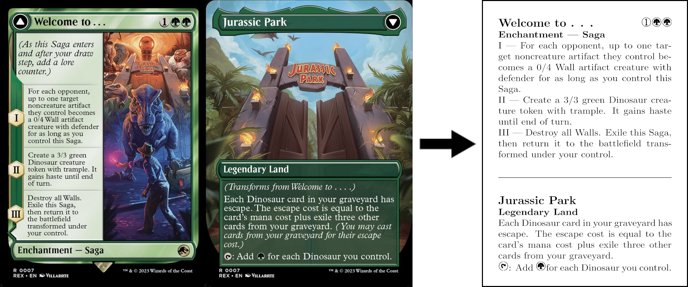

# Collection of MtG Proxies

This is a tool to create proxies for Magic the Gathering.
For now it only works for double faced cards.

## ToDo

- warn if output exedes 1 page or automatically scale (e.g. Kytheon Hero of akros // Gideon Battle-Forged set: ORI nr: 23)

## Wishlist

- Also work for single faced card to create a proxy with the up to date oracle text.
- Specify multiple cards, create multiple minipages on an A4 sheet for easier printing.

## Source for the Mana Symbols

https://mana.andrewgioia.com/index.html
